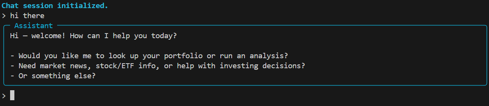

<h1>Portfolio Chat
    </h1>

[](https://github.com/samyuktha-ramesh/portfolio-chat/actions/workflows/ci.yml)
[](https://www.python.org/)
[](https://pre-commit.com/)
[](https://github.com/samyuktha-ramesh/portfolio-chat/blob/main/LICENSE)

Modern Large Language Models (LLMs) are extremely capable of creative tasks and reasoning, however often struggle with grounding their responses in external knowledge. Traditional RAG approaches involve retrieving relevant documents or data from a knowledge base and using that information to inform the model's responses. However, tabular data presents unique challenges for RAG: The structure and format of tabular data can make it difficult for LLMs to interpret and utilize effectively. 

This repository contains a robust framework for retrieving and processing tabular data to enhance the capabilities of LLMs. We introduce portfolio-chat, a specialized tool for working with tabular portfolio data. However, this approach generalizes to all tabular data use cases. Developed as part of the [ETH Zurich FinsureTech Hub Innovation Project](https://finsuretech.ethz.ch/continuing-education/cas-ml-in-finance-and-insurance/innovation-projects.html) in collaboration with [PwC Switzerland](https://www.pwc.ch/).

## Overview

You can interact with the model through a command line interface (CLI) that allows you to ask questions about your portfolio data:



> Alternatively, you can visit the [demo page](https://agentportfolio.vercel.app/) hosted on Vercel. Note that the demo uses fictitious data for demonstration purposes and might take a minute to spin up.

## Installation

1. To install the necessary dependencies, we recommend [uv](https://docs.astral.sh/uv/):

    ```bash
    pip install uv
    uv sync
    ```

    However, if you prefer not to use uv, you can manually install the dependencies listed in `pyproject.toml` using pip:

    ```bash
    python -m venv .venv
    source .venv/bin/activate # Windows: .venv/Scripts/activate 
    pip install -e .[dev]
    ```

2. Download the necessary data files and place them in the data directory. Make sure to update the code agent's system prompt in `src/portfolio_chat/configs/tools.yaml` to reflect the structure of your data files.

3. Copy `.env.example` to `.env` and update the environment variables as needed.

4. (Optional) if you want to make contributions, set up pre-commit hooks:

    ```bash
    uv add pre-commit  # or: pip install pre-commit
    pre-commit install
    ```

## Usage

Once the dependencies are installed and the data files are in place, you can chat with the model using the command line interface (CLI).

```sh
portfolio-chat
```

You can use the Hydra CLI to interact with the model and configuration. For example, you might want to specify a different model (or model provider)

```sh
portfolio-chat model.name="gpt-4.1" prompts.system="You are a helpful assistant."
```

The following commands are available:

```
/help: Displays this help message.
/reset: Resets the conversation history.
/quit: Exits the chat.
```

## Configuration

This project uses Hydra for configuration management. Please refer to the [Hydra documentation](https://hydra.cc/docs/intro/) for more information on how to configure your application. The configuration files are located in the src\portfolio_chat\configs directory.

The configuration defines models, prompts, and other settings for the application.
